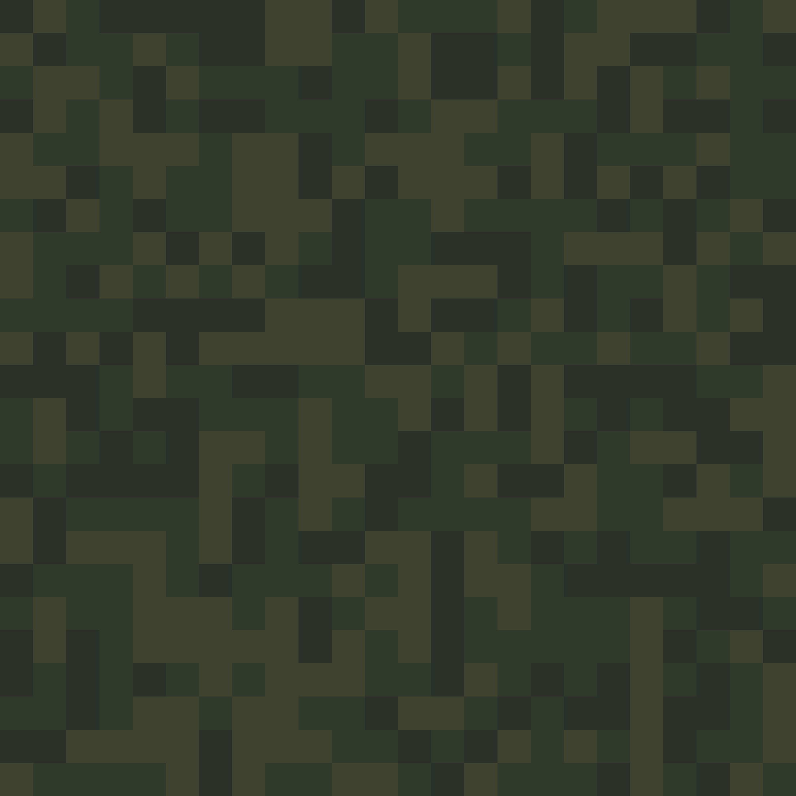

# Digital Camouflage Pattern Generator

This is a Python script that generates a digital camouflage pattern with randomly colored blocks. Each block consists of 100x100 pixels, and the pattern covers a total of 2400x1600 pixels.

## Dependencies

To run this script, you need to have the following dependencies installed:

- Python 3
- Pillow (Python Imaging Library)

You can install Pillow by running the following command in your terminal or command prompt:

    pip install pillow

## Usage

To generate a digital camouflage pattern, simply run the `digital_camouflage.py` script in your Python environment. The pattern will be saved to a file called `digital_camouflage.png` in the same directory as the script.

You can modify the following variables in the script to customize the pattern:

- `BLOCKS_X`: Number of color blocks horizontally (default: 24)
- `BLOCKS_Y`: Number of color blocks vertically (default: 16)
- `DENSITY`: Density of the pattern (default: 1.0)
- `colors`: List of colors used in the pattern (default: randomly generated list of 3 colors)

## Example

Here is an example digital camouflage pattern generated by the script:

## License

This script is licensed under the MIT License. See the `LICENSE` file for more information.
